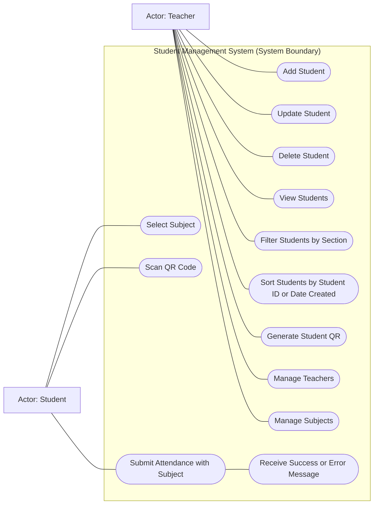
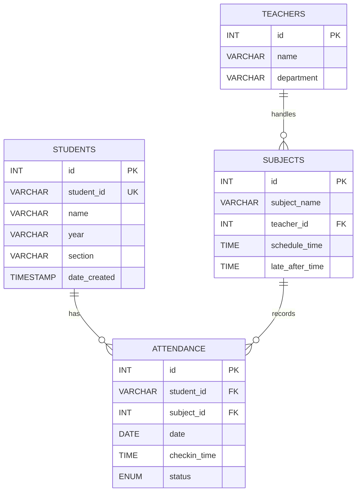
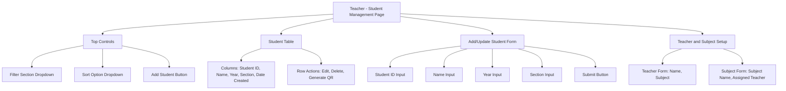
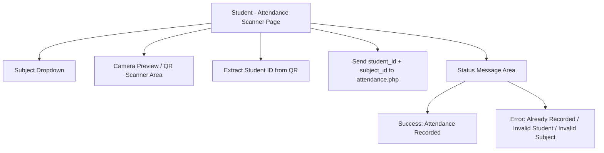
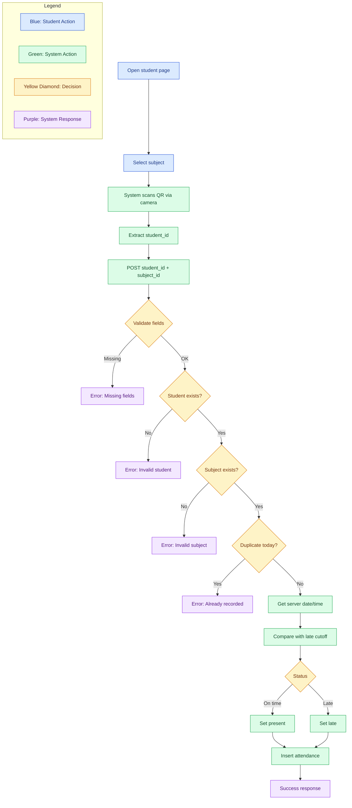

# Student Management System with QR-Based Attendance

## 1. System Overview

This project is a web-based **Student Management System** with **QR code attendance tracking**.
It is designed for a simple school setup where:

- **A single teacher profile** manages student records, subjects, and student QR codes.
- **Students** scan their QR codes to record attendance.

The system is built using:

- PHP (no framework)
- MySQL (via phpMyAdmin)
- XAMPP
- HTML, CSS, JavaScript

Each student QR code stores **only the `student_id`**.  
Attendance is recorded with date and time, and each student is limited to **one attendance record per subject per day**.

---

## 2. Features

### Teacher Side (`/teacher`)

- Add new students
- Update student information
- Delete students
- Manage teachers and subjects (simple setup)
- View all students in table format
- Filter students by section
- Sort students by:
  - `student_id`
  - `date_created`
- Generate QR code per student (QR content = `student_id` only)

### Student Side (`/student`)

- Select subject before scanning
- Open camera for QR scanning
- Extract `student_id` from scanned QR
- Send `student_id` + `subject_id` to backend attendance endpoint
- Automatically save attendance date and time for selected subject
- Display success or error message after scan

---

## 3. System Architecture

The system follows a simple two-route structure:

1. **Teacher Module (`/teacher`)**
   - Handles all student record management and QR generation.
   - Performs CRUD operations on the `students` table.
   - Maintains `teachers` and `subjects` references for class attendance context.

2. **Student Module (`/student`)**
   - Provides a QR scanner interface through browser camera access.
   - Requires subject selection first, then scans QR to get `student_id`.
   - Sends `student_id` and `subject_id` to backend attendance processor.
   - Attendance processor validates student and subject, then checks duplicate rule (`student_id + subject_id + date`) before inserting into `attendance`.

3. **Database Layer (`MySQL`)**
   - Stores student profiles in `students`.
   - Stores teacher records in `teachers`.
   - Stores subject records in `subjects`.
   - Stores attendance logs in `attendance`.
   - Enforces data consistency using unique/foreign key constraints.

4. **Shared resources**
   - `dbconfig.php` for database connection
   - `assets/css/base.css` for layout, cards, buttons, and home tiles
   - `assets/css/teacher.css` for the teacher dashboard (lists, subject cards, QR modal)
   - `assets/css/student.css` for the student portal (subject picker, QR attendance areas)
   - `assets/js/teacher.js` for the teacher dashboard (student list, subjects list, QR modal)
   - `assets/js/student.js` for the student portal (subject picker, attendance UI)

---

## 4. Use Case Diagram



---

## 5. Entity Relationship Diagram (ERD)



---

### ERD Table and Field Purpose

- `students`: master list of enrolled students. `student_id` is the QR value and unique student reference.
- `teachers`: stores teacher profile information (project scope: single teacher profile can be used).
- `teachers`: stores teacher profile information (project scope: single teacher profile can be used).
  - unique key on `(name, subject)` prevents duplicate teacher+subject records.
- `subjects`: list of subjects handled by a teacher, including schedule reference:
  - `schedule_time`: official class start time
  - `late_after_time`: cutoff where scan status becomes `late`
  - unique key on `(subject_name, teacher_id, schedule_time, late_after_time)` prevents duplicate subject definitions.
- `attendance`: daily attendance log per student per subject:
  - `checkin_time`: actual scan/login time
  - `status`: `present`, `late`, or `absent`
  - unique key on `student_id + subject_id + date` prevents duplicate daily entries per subject.

---

## 6. Wireframe / UI Prototype

### Teacher Module Wireframe



### Student Module Wireframe



---

## 7. Database Schema (SQL)

```sql
-- Create database first (optional name)
CREATE DATABASE IF NOT EXISTS student_management_system;
USE student_management_system;

-- Students table
CREATE TABLE IF NOT EXISTS students (
    id INT AUTO_INCREMENT PRIMARY KEY,
    student_id VARCHAR(50) NOT NULL UNIQUE,
    name VARCHAR(100) NOT NULL,
    year VARCHAR(20) NOT NULL,
    section VARCHAR(50) NOT NULL,
    date_created TIMESTAMP DEFAULT CURRENT_TIMESTAMP
);

-- Teachers table
CREATE TABLE IF NOT EXISTS teachers (
    id INT AUTO_INCREMENT PRIMARY KEY,
    name VARCHAR(100) NOT NULL,
    department VARCHAR(100) NOT NULL,
    CONSTRAINT uq_teachers_name_department
        UNIQUE (name, department)
);

-- Subjects table
CREATE TABLE IF NOT EXISTS subjects (
    id INT AUTO_INCREMENT PRIMARY KEY,
    subject_name VARCHAR(100) NOT NULL,
    teacher_id INT NOT NULL,
    schedule_time TIME NOT NULL,
    late_after_time TIME NOT NULL,
    CONSTRAINT uq_subjects_unique
        UNIQUE (subject_name, teacher_id, schedule_time, late_after_time),
    CONSTRAINT fk_subjects_teacher
        FOREIGN KEY (teacher_id) REFERENCES teachers(id)
        ON UPDATE CASCADE
        ON DELETE CASCADE
);

-- Attendance table
CREATE TABLE IF NOT EXISTS attendance (
    id INT AUTO_INCREMENT PRIMARY KEY,
    student_id VARCHAR(50) NOT NULL,
    subject_id INT NOT NULL,
    date DATE NOT NULL,
    checkin_time TIME NULL,
    status ENUM('present', 'late', 'absent') NOT NULL DEFAULT 'absent',
    CONSTRAINT fk_attendance_student
        FOREIGN KEY (student_id) REFERENCES students(student_id)
        ON UPDATE CASCADE
        ON DELETE CASCADE,
    CONSTRAINT fk_attendance_subject
        FOREIGN KEY (subject_id) REFERENCES subjects(id)
        ON UPDATE CASCADE
        ON DELETE CASCADE,
    CONSTRAINT uq_attendance_student_subject_date
        UNIQUE (student_id, subject_id, date)
);
```

---

## QR Attendance Flow Diagram (Mermaid)



---

## 8. Attendance Validation Rules

- Accept attendance only when both `student_id` and `subject_id` are provided.
- Reject attendance if `student_id` does not exist in `students`.
- Reject attendance if `subject_id` does not exist in `subjects`.
- Reject duplicate attendance for the same `student_id + subject_id + date`.
- Save server-side current date and `checkin_time` when attendance is valid.
- Determine status using subject schedule:
  - `present` if scan time is on/before `late_after_time`
  - `late` if scan time is after `late_after_time`
- Keep `absent` as default for records that are not yet scanned.
- To fully use default `absent`, the system should pre-create daily attendance rows per student per subject, then update them to `present/late` on scan.

---

## 9. Student Attendance API Contract

Endpoint: `/student/attendance.php`

Request method:

- `POST`

Required fields:

- `student_id` (string, from QR scan)
- `subject_id` (integer, from subject dropdown)

Response format (JSON):

```json
{
	"success": true,
	"message": "Attendance recorded successfully."
}
```

```json
{
	"success": false,
	"message": "Attendance already recorded for this subject today."
}
```

---

## 10. Setup and Run Guide (Local)

1. Install and open XAMPP.
2. Start `Apache` and `MySQL`.
3. Place project folder in `htdocs`:
   - `C:/xampp/htdocs/student-management-system`
4. Create local DB config:
   - Copy `dbconfig.example.php` to `dbconfig.php`
5. Confirm database credentials in `dbconfig.php`.
   - Default XAMPP values usually work: `localhost`, `root`, empty password
6. Run migrations (code-first schema setup):
   - `php migrate.php`
7. Access the app (front controller):
   - `http://localhost/student-management-system/`
8. Teacher module:
   - `http://localhost/student-management-system/teacher`
9. Student module:
   - `http://localhost/student-management-system/student`

> Note: routing uses Apache rewrite rules via `.htaccess`. Ensure Apache has `mod_rewrite` enabled and `AllowOverride All` for the project directory (XAMPP default usually works).

---

## 11. Simple Code-First Migrations

Use this flow for DB changes:

1. Create a new file in `/migrations`  
   Example: `add_new_column_student_table.php`
2. Add migration content in the file:
   - simplest: return one SQL string
   - optional: return an array of SQL strings
   - advanced: return a callable (`function (mysqli $conn): bool { ... }`)
3. Run:
   - `php migrate.php`
   - `php migrate.php --all` (run all pending in filename order)
   - `php migrate.php --file=your_migration_file.php` (run one specific pending file)

`migrate.php` default behavior runs only the latest pending migration file.
Use `--all` to run all pending migrations in filename order.
Executed migrations are stored in the `migrations` table, so one file runs only once.

### Migration commands

Run from project root (`C:/xampp/htdocs/student-management-system`):

- Latest pending migration only:
  - `php migrate.php`
- All pending migrations in order:
  - `php migrate.php --all`
- Specific pending migration file:
  - `php migrate.php --file=20260507_100003_seed_subjects.php`

If `php` is not recognized in terminal, use XAMPP PHP directly:

- `C:/xampp/php/php.exe migrate.php`
- `C:/xampp/php/php.exe migrate.php --all`
- `C:/xampp/php/php.exe migrate.php --file=20260507_100003_seed_subjects.php`

### FK-safe insert order (hierarchy)

Use this order when adding seed/sample data:

1. `teachers` (no FK dependency)
2. `students` (no FK dependency)
3. `subjects` (depends on `teachers.id`)
4. `attendance` (depends on `students.student_id` and `subjects.id`)

Sample migration files added in this order:

- `20260507_100001_seed_teachers.php`
- `20260507_100002_seed_students.php`
- `20260507_100003_seed_subjects.php`
- `20260507_100004_seed_attendance.php`
- For existing duplicate data cleanup, run:
  - `20260507_100005_dedupe_teachers_subjects.php`

---

## File Structure

Simple MVC-style layout: one entry point, a single route file, controllers, models, and views.

```text
/student-management-system
│
├── /assets
│   ├── /css
│   │   ├── base.css              ← Layout, cards, buttons, and home tiles
│   │   ├── teacher.css           ← Teacher dashboard styling
│   │   └── student.css           ← Student portal styling
│   └── /js
│       ├── ui-helpers.js         ← Reusable UI utilities (modals, forms, notifications)
│       ├── api-client.js         ← Centralized API client with error handling
│       ├── teacher.js            ← Teacher dashboard logic (uses helpers above)
│       ├── teacher-row-helpers.js← Student row rendering helpers
│       └── student.js            ← Student portal logic
│
├── /controllers
│   ├── HomeController.php        ← Home/index page
│   ├── TeacherController.php     ← Teacher module endpoints + teachersHierarchyJson()
│   └── StudentController.php     ← Student module endpoints
│
├── /models
│   ├── Teacher.php               ← Teacher table CRUD
│   ├── Subject.php               ← Subject table CRUD with advanced filtering
│   ├── Student.php               ← Student table CRUD
│   └── Attendance.php            ← Attendance table CRUD
│
├── /modelHelpers
│   ├── TeacherFormatter.php      ← Data transformation: hierarchical grouping, validation
│   └── SqlSearch.php             ← Search utility for filtering/searching
│
├── /views
│   ├── /teacher
│   │   ├── index.php             ← Teacher dashboard page
│   │   └── /partials
│   │       ├── _teacher-card.php ← Reusable teacher card template
│   │       └── _subject-card.php ← Reusable subject card template
│   ├── /student
│   │   └── index.php             ← Student portal page
│   ├── /home
│   │   └── index.php             ← Home/landing page
│   └── /errors
│       └── 404.php               ← 404 error page
│
├── /database
│   └── schema.sql                ← Database schema (department column)
│
├── /migrations                   ← Migration files run by migrate.php
│   └── 20260507_000001_initial_schema.php
│
├── migrate.php                   ← Migration runner (php migrate.php)
├── routes.php                    ← URL path → [Controller, method]
├── .htaccess                     ← Sends requests to root index.php
├── index.php                     ← Front controller: loads routes, runs the right controller
├── dbconfig.php                  ← Database configuration (local copy, not in git)
├── dbconfig.example.php          ← Example database configuration
└── README.md                     ← Project documentation
```

---

## Key Files and Their Purpose

### JavaScript Helpers (Refactored for Separation of Concerns)

- **ui-helpers.js** - Reusable UI utilities extracted from teacher.js
  - Modal management: `openModal()`, `closeModal()`, `attachEscapeKeyListener()`
  - Form management: `showForm()`, `hideForm()`, `resetForm()`, `focusFirstInput()`
  - Event delegation: `addDelegatedListener()`, `getElementData()`
  - HTML escaping: `escapeHtml()` for XSS prevention
  - Utility: `debounce()`, `confirm()`

- **api-client.js** - Centralized API client for all HTTP requests
  - HTTP methods: `get()`, `post()`, `put()`, `delete()`, `request()`
  - Error handling: `handleError()` with user-friendly messages
  - Validation: `validateRequired()` for client-side field validation
  - Consistent response parsing and error status handling

- **teacher.js** - Teacher dashboard logic (refactored to use helpers above)
  - Student management (CRUD)
  - Teacher management with modal forms
  - Subject management under teachers
  - QR code generation
  - Now uses `ApiClient` for all API calls and `UIHelpers` for UI interactions

### PHP Helpers (Server-Side Logic)

- **TeacherFormatter.php** - Data transformation and validation
  - `groupSubjectsByTeacher()` - Groups subjects hierarchically by teacher_id
  - `enrichTeacherData()` - Adds computed fields (subject count, display name)
  - `formatHierarchy()` - Combines teachers and subjects into single response structure
  - `validateTeacher()` - Validates teacher input fields
  - `validateSubject()` - Validates subject input fields with time format checking

### Controllers (Updated with New Endpoint)

- **TeacherController.php** - Teacher module endpoints
  - New: `teachersHierarchyJson()` - Returns pre-grouped teachers and subjects
  - Uses `TeacherFormatter` for data transformation
  - Uses `validateTeacher()` and `validateSubject()` for input validation
  - All CRUD operations use centralized validation

### Templates (New for Better Organization)

- **\_teacher-card.php** - Teacher card component template
  - Displays teacher name, department label, and subject count
  - Includes collapsible subject list
  - Ready for server-side rendering when needed

- **\_subject-card.php** - Subject card component template
  - Displays subject name, schedule time, and late after time
  - Includes edit/delete action buttons
  - Uses SVG icons for actions

---

## Scope and Limitations

- No authentication/login system is included.
- The project scope assumes one teacher account/profile handling multiple subjects.
- The system is designed for beginner-friendly PHP + MySQL implementation.
- Student QR code stores only `student_id` (no subject or personal data in QR).
- Attendance is limited to one record per student per subject per day with status (`present`, `late`, `absent`).
- Built for local deployment and testing using XAMPP + phpMyAdmin.

---

## Refactored Architecture (PHP-First Approach)

### Separation of Concerns - Phase 1 & 2 Refactoring

The system was refactored to shift logic from JavaScript to PHP, improving maintainability and code reuse:

#### JavaScript Layer (UI Concerns Only)

- **ui-helpers.js** - Reusable UI patterns
  - Modal management, form handling, notifications
  - Event delegation and DOM utilities
  - NO business logic, pure UI utilities

- **api-client.js** - Unified API communication
  - Centralized HTTP methods (GET, POST, PUT, DELETE)
  - Consistent error handling with user feedback
  - Validates responses before returning to caller

#### PHP Layer (Business Logic)

- **TeacherFormatter.php** - Data transformation
  - Hierarchical grouping of subjects by teacher
  - Data enrichment (subject count, display labels)
  - Centralized validation for teachers and subjects

- **TeacherController.php** - API Endpoints
  - `teachersHierarchyJson()` - Returns pre-processed hierarchical data
  - Uses TeacherFormatter for all data transformation
  - Centralized validation before database operations

- **\_teacher-card.php & \_subject-card.php** - Templates
  - Ready for server-side rendering
  - Separate HTML generation from logic
  - Can be used with or without JavaScript rendering

### Data Flow (Refactored)

**Before Refactoring:**

```
Client (teacher.js)
  → fetch(/teachers)
  → fetch(/subjects)
  → JavaScript groups by teacher_id
  → JavaScript renders HTML
```

**After Refactoring:**

```
Client (teacher.js using ApiClient)
  → ApiClient.get(/teachers-hierarchy)
  → Server (TeacherFormatter) pre-groups data
  → Returns structured JSON { teachers, subjectsByTeacher }
  → JavaScript renders using UIHelpers
```

### Benefits

1. **Reduced JavaScript Size** - Removed 300+ lines of data transformation logic
2. **Single Source of Truth** - Data structure defined once in PHP, reused everywhere
3. **Better Testability** - Validation and formatting logic in PHP is testable independently
4. **Reusable Components** - UIHelpers and ApiClient can be used by other modules
5. **Easier Maintenance** - Clear separation: PHP handles logic, JS handles UI
