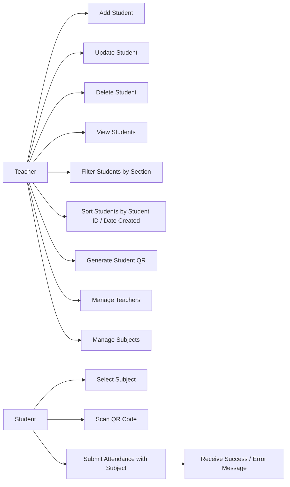
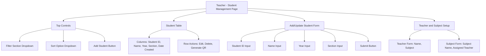
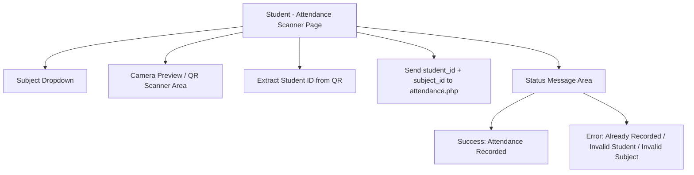

# Student Management System with QR-Based Attendance

## 1. System Overview

This project is a web-based **Student Management System** with **QR code attendance tracking**.
It is designed for a simple school setup where:

- **A single teacher profile** manages student records, subjects, and student QR codes.
- **Students** scan their QR codes to record attendance.

The system is built using:

- PHP (no framework)
- MySQL (via phpMyAdmin)
- XAMPP
- HTML, CSS, JavaScript

Each student QR code stores **only the `student_id`**.  
Attendance is recorded with date and time, and each student is limited to **one attendance record per subject per day**.

---

## 2. Features

### Teacher Side (`/teacher`)

- Add new students
- Update student information
- Delete students
- Manage teachers and subjects (simple setup)
- View all students in table format
- Filter students by section
- Sort students by:
  - `student_id`
  - `date_created`
- Generate QR code per student (QR content = `student_id` only)

### Student Side (`/student`)

- Select subject before scanning
- Open camera for QR scanning
- Extract `student_id` from scanned QR
- Send `student_id` + `subject_id` to backend attendance endpoint
- Automatically save attendance date and time for selected subject
- Display success or error message after scan

---

## 3. System Architecture

The system follows a simple two-route structure:

1. **Teacher Module (`/teacher`)**
   - Handles all student record management and QR generation.
   - Performs CRUD operations on the `students` table.
   - Maintains `teachers` and `subjects` references for class attendance context.

2. **Student Module (`/student`)**
   - Provides a QR scanner interface through browser camera access.
   - Requires subject selection first, then scans QR to get `student_id`.
   - Sends `student_id` and `subject_id` to backend attendance processor.
   - Attendance processor validates student and subject, then checks duplicate rule (`student_id + subject_id + date`) before inserting into `attendance`.

3. **Database Layer (`MySQL`)**
   - Stores student profiles in `students`.
   - Stores teacher records in `teachers`.
   - Stores subject records in `subjects`.
   - Stores attendance logs in `attendance`.
   - Enforces data consistency using unique/foreign key constraints.

4. **Shared Resources**
   - `dbconfig.php` for database connection
   - `style.css` for common styling
   - `script.js` for frontend behavior

---

## 4. Use Case Diagram 



---

## 5. Entity Relationship Diagram (ERD)


---

### ERD Table and Field Purpose

- `students`: master list of enrolled students. `student_id` is the QR value and unique student reference.
- `teachers`: stores teacher profile information (project scope: single teacher profile can be used).
- `subjects`: list of subjects handled by a teacher, including schedule reference:
  - `schedule_time`: official class start time
  - `late_after_time`: cutoff where scan status becomes `late`
- `attendance`: daily attendance log per student per subject:
  - `checkin_time`: actual scan/login time
  - `status`: `present`, `late`, or `absent`
  - unique key on `student_id + subject_id + date` prevents duplicate daily entries per subject.

---

## 6. Wireframe / UI Prototype (Mermaid)

### Teacher Module Wireframe



### Student Module Wireframe



---

## 7. Database Schema (SQL)

```sql
-- Create database first (optional name)
CREATE DATABASE IF NOT EXISTS student_management_system;
USE student_management_system;

-- Students table
CREATE TABLE IF NOT EXISTS students (
    id INT AUTO_INCREMENT PRIMARY KEY,
    student_id VARCHAR(50) NOT NULL UNIQUE,
    name VARCHAR(100) NOT NULL,
    year VARCHAR(20) NOT NULL,
    section VARCHAR(50) NOT NULL,
    date_created TIMESTAMP DEFAULT CURRENT_TIMESTAMP
);

-- Teachers table
CREATE TABLE IF NOT EXISTS teachers (
    id INT AUTO_INCREMENT PRIMARY KEY,
    name VARCHAR(100) NOT NULL,
    subject VARCHAR(100) NOT NULL
);

-- Subjects table
CREATE TABLE IF NOT EXISTS subjects (
    id INT AUTO_INCREMENT PRIMARY KEY,
    subject_name VARCHAR(100) NOT NULL,
    teacher_id INT NOT NULL,
    schedule_time TIME NOT NULL,
    late_after_time TIME NOT NULL,
    CONSTRAINT fk_subjects_teacher
        FOREIGN KEY (teacher_id) REFERENCES teachers(id)
        ON UPDATE CASCADE
        ON DELETE CASCADE
);

-- Attendance table
CREATE TABLE IF NOT EXISTS attendance (
    id INT AUTO_INCREMENT PRIMARY KEY,
    student_id VARCHAR(50) NOT NULL,
    subject_id INT NOT NULL,
    date DATE NOT NULL,
    checkin_time TIME NULL,
    status ENUM('present', 'late', 'absent') NOT NULL DEFAULT 'absent',
    CONSTRAINT fk_attendance_student
        FOREIGN KEY (student_id) REFERENCES students(student_id)
        ON UPDATE CASCADE
        ON DELETE CASCADE,
    CONSTRAINT fk_attendance_subject
        FOREIGN KEY (subject_id) REFERENCES subjects(id)
        ON UPDATE CASCADE
        ON DELETE CASCADE,
    CONSTRAINT uq_attendance_student_subject_date
        UNIQUE (student_id, subject_id, date)
);
```

---

## 8. Attendance Validation Rules

- Accept attendance only when both `student_id` and `subject_id` are provided.
- Reject attendance if `student_id` does not exist in `students`.
- Reject attendance if `subject_id` does not exist in `subjects`.
- Reject duplicate attendance for the same `student_id + subject_id + date`.
- Save server-side current date and `checkin_time` when attendance is valid.
- Determine status using subject schedule:
  - `present` if scan time is on/before `late_after_time`
  - `late` if scan time is after `late_after_time`
- Keep `absent` as default for records that are not yet scanned.
- To fully use default `absent`, the system should pre-create daily attendance rows per student per subject, then update them to `present/late` on scan.

---

## 9. Student Attendance API Contract

Endpoint: `/student/attendance.php`

Request method:

- `POST`

Required fields:

- `student_id` (string, from QR scan)
- `subject_id` (integer, from subject dropdown)

Response format (JSON):

```json
{
  "success": true,
  "message": "Attendance recorded successfully."
}
```

```json
{
  "success": false,
  "message": "Attendance already recorded for this subject today."
}
```

---

## 10. Setup and Run Guide (Local)

1. Install and open XAMPP.
2. Start `Apache` and `MySQL`.
3. Place project folder in `htdocs`:
   - `C:/xampp/htdocs/student-management-system`
4. Open phpMyAdmin and create/import the database schema from this README.
5. Confirm database credentials in `dbconfig.php`.
6. Access teacher module:
   - `http://localhost/student-management-system/teacher`
7. Access student module:
   - `http://localhost/student-management-system/student`

---

## File Structure

```text
/project-folder
│── /teacher
│   │── index.php
│   │── insert.php
│   │── update.php
│   │── delete.php
│   │── qr_generate.php
│
│── /student
│   │── index.php
│   │── attendance.php
│
│── dbconfig.php
│── style.css
│── script.js
│── README.md
```

---

## Scope and Limitations

- No authentication/login system is included.
- The project scope assumes one teacher account/profile handling multiple subjects.
- The system is designed for beginner-friendly PHP + MySQL implementation.
- Student QR code stores only `student_id` (no subject or personal data in QR).
- Attendance is limited to one record per student per subject per day with status (`present`, `late`, `absent`).
- Built for local deployment and testing using XAMPP + phpMyAdmin.
